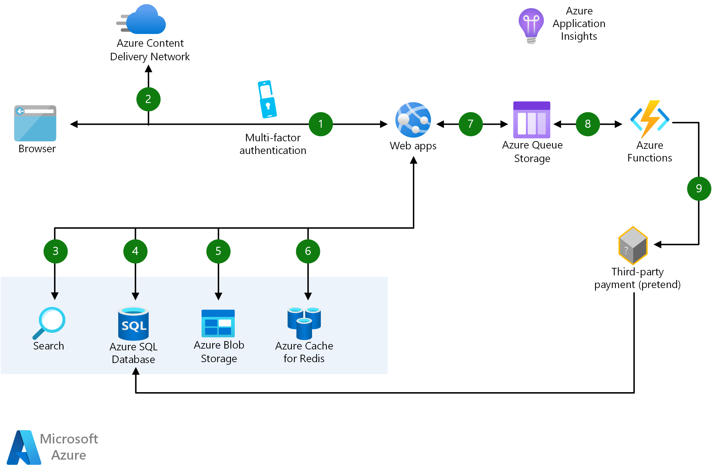

# E-Commerce Web Application with Azure Functions & Web Apps

  

## Overview

This repository contains a solution for building scalable e-commerce web applications using Azure Functions and Web Apps. The solution allows developers to create personalized experiences while Azure manages the infrastructure. It is particularly suitable for the retail industry, but it can also be applied to other industries that sell goods and services.

## Solution Idea

The solution idea is based on the article "Architect scalable e-commerce web app" on the Azure Architecture Center. The article includes potential use cases, architecture diagrams, and data flow descriptions. It also provides links to get started with Web Apps, learn about Azure Functions, and understand Application Performance Management with Application Insights. For more details please click on this [link](https://learn.microsoft.com/en-us/azure/architecture/web-apps/idea/scalable-ecommerce-web-app)

## Architecture

The architecture of the solution is designed to be scalable and efficient. It uses Azure Functions for serverless compute and Azure Web Apps for hosting the web application. The architecture diagram provides a visual representation of the data flow and the components involved.

  
  <h3 align="center">Scalable e-commerce web apps with Azure Functions and Web Apps </h3>

## Getting Started

To get started with this solution, you need to have an Azure account. If you don't have one, you can create a free account. Once you have an account, you can follow the links provided in the article to learn about Web Apps, Azure Functions, and Application Insights.

## Contributing

Contributions are welcome! Please read the contributing guidelines before making any changes.

## License

This project is licensed under the MIT License. See the LICENSE file for details.
